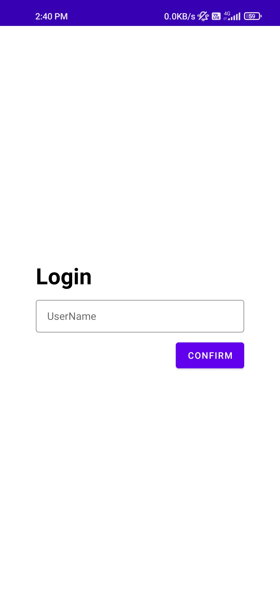
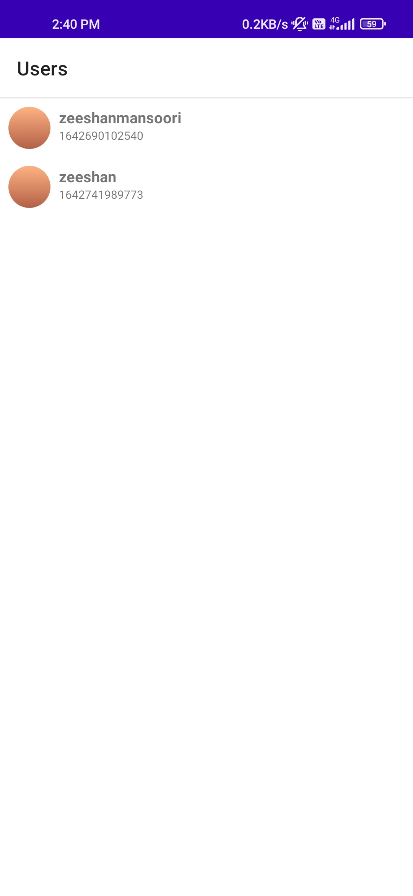
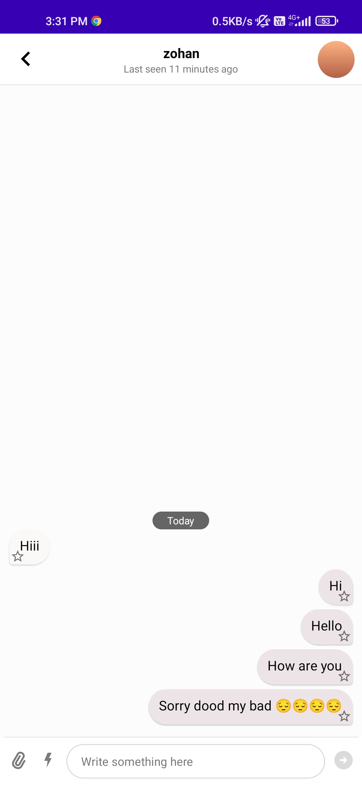
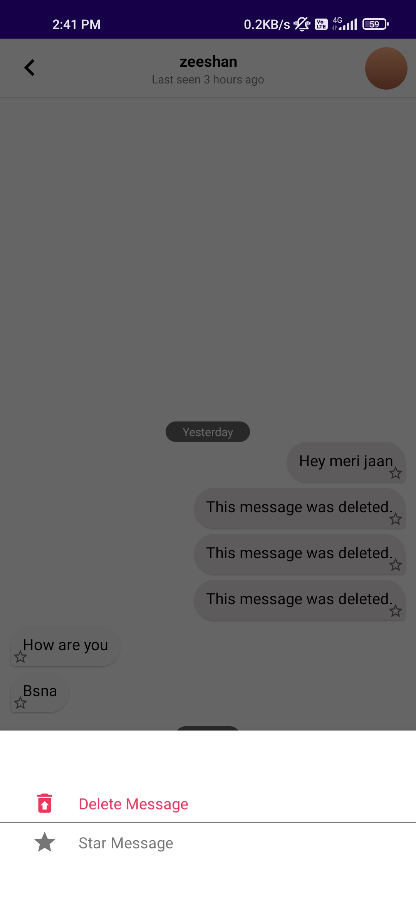

# ChatAppStream
Chatting app (getstream.io)

# Features
 ### login:
- Guest Login

| |
|--------|

### Channels:
- DM messages.
- Display channels related to current logged in user.

|  |
| --------|

### All users :
- Display all available users.

|  |
| --------|

### Chat:
- Chat Screen for direct messaging.

|  |
| --------|

### Chat actions :
 - has option to delete message.
 - has option to mark star the message.
   (partially broken)

|  |
| --------|

### Demo
|  |
| --------|

